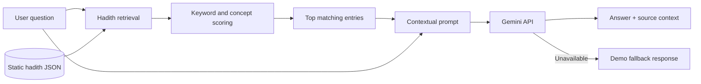
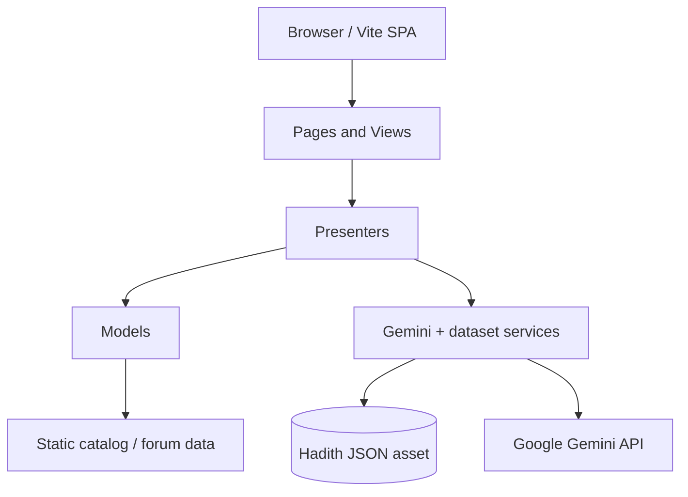

# UsStuck

**A hackathon-built Islamic learning prototype combining hadith discovery, contextual AI Q&A, and a community discussion interface.**

**3rd Place — National Hackathon** · Team project · Web / AI integration


UsStuck explores how an accessible web interface can help people discover hadith references, ask questions about Islamic topics, and explore discussions in one place. It was developed as a **hackathon prototype**, not as a scholar-verified religious authority or a production community platform.

The codebase is a browser-based **Vanilla JavaScript SPA** with Vite, a Model–View–Presenter (MVP) structure, a static hadith dataset, and an experimental Google Gemini integration.

> **Project status:** Historical hackathon prototype. Core pages and demo interactions are implemented, but the forum and authentication use local demo data. The configured Gemini model is retired, so live AI responses require maintenance before they can be relied on.

## Why we built it

Online Islamic learning resources are spread across Q&A sites, hadith collections, and discussion platforms. During the hackathon, our team designed UsStuck to explore a more connected experience:

- **Ask:** pose a question and receive a context-aware response informed by retrieved hadith records.
- **Discover:** browse and search collections and their entries.
- **Discuss:** explore topic-based conversations through a forum-style interface.

The central design idea is to **pair generative answers with inspectable source context**, rather than presenting an AI response as an unquestionable answer.

## Features in the repository

| Area | What is implemented | Important boundary |
| --- | --- | --- |
| Ask AI | Chat-style UI; relevant hadith retrieval; contextual Gemini prompt; source display | Falls back to predefined answers if Gemini is unavailable; output is not independently verified |
| Hadith retrieval | Loads a static JSON dataset; matches keywords and Islamic concepts; scores and selects relevant entries | Client-side heuristic retrieval, not a trained semantic search or authoritative validation engine |
| Catalog | Collection/category browsing, item details, and search/filter interactions | Catalog entries are defined in local JavaScript model data |
| Forum | Topic list, categories, search, topic details, example comments and likes | Demo/in-memory data; **no persistent multi-user backend** |
| Login | Login/register UI, demo accounts, local browser session representation | Mock client-side authentication; **not real account security** |
| Navigation | Hash-based SPA routes for home, Ask AI, catalog, forum, about, login, and privacy | No server-side rendered pages or production API |

### AI answer flow



In [`dataset-service.js`](src/scripts/services/dataset-service.js), the browser loads hadith records and ranks matches using keyword overlap, mapped Islamic concepts, and source-aware scoring. The service supplies a small set of relevant records as context for [`gemini-service.js`](src/scripts/services/gemini-service.js). The UI distinguishes Gemini-generated output from fallback responses.

**Citations shown by the prototype are not a guarantee of authenticity.** The model may hallucinate, misattribute, or misinterpret religious references. Users should verify quotations and conclusions against reliable primary sources and qualified scholars.

## Technology and architecture

| Layer | Technology |
| --- | --- |
| Interface | HTML5, CSS3, Vanilla JavaScript (ES modules) |
| Build tooling | Vite 6, npm |
| Design pattern | Model–View–Presenter (MVP) |
| Navigation | Client-side hash router |
| AI experimentation | Google Gemini REST API via browser `fetch` |
| Data | Static `hadits.json`; local JavaScript catalog and forum models |
| Browser utilities | Local cache, quota tracking, and rate-limiting helpers |
| Deployment configuration | Netlify static build configuration |



**No Node.js application server or database server is implemented in this repository.** The Gemini integration is called from the browser; Node.js is used to develop and build the static application.

### Repository structure

```text
UsStuck/
├── src/
│   ├── index.html
│   ├── scripts/
│   │   ├── models/         # Client-side state and data models
│   │   ├── views/          # UI markup and interactions
│   │   ├── presenters/     # Connect pages, models, and views
│   │   ├── pages/          # Routed pages
│   │   ├── routes/         # Hash router
│   │   ├── services/       # Dataset loading and Gemini integration
│   │   ├── utils/          # Client cache, quota, API helpers
│   │   └── data/           # Original dataset and research files
│   ├── styles/
│   └── public/             # Static assets copied by Vite
├── vite.config.js
├── prepare-deploy.js
├── netlify.toml
├── DEPLOYMENT.md
└── package.json
```

## Run locally

**Prerequisites:** Node.js compatible with Vite 6 and npm.

```bash
git clone https://github.com/alfrzhb/UsStuck.git
cd UsStuck
npm ci
npm run dev
```

Open **http://localhost:5173**. You can explore the pages and demo functionality without connecting to Gemini. If an AI request fails, the current application can return a predefined fallback response.

### About environment configuration

The template is [`.env.example`](.env.example). This repository sets Vite's application root to `src/`, so Vite's default environment directory is also `src/`, not the repository root. For **local experimentation only**, the existing frontend integration expects its `VITE_*` variables in `src/.env` (or set in the process environment).

```bash
cp .env.example src/.env
```

**Do not put a production or unrestricted API key in `VITE_GEMINI_API_KEY`.** Vite embeds `VITE_*` values in browser-accessible code. The current [config](src/scripts/config.js) and [Gemini service](src/scripts/services/gemini-service.js) send requests directly from the browser, so an API key used this way is **not secret**, regardless of whether `.env` is git-ignored. A server-side proxy or other approved secret-handling design is necessary before offering live AI to public users.

The repository currently hard-codes `gemini-1.5-flash` in [`src/scripts/config.js`](src/scripts/config.js). **Gemini 1.5 has been shut down**; selecting a currently supported API model and retesting the integration requires a code change. See [Google's model lifecycle documentation](https://ai.google.dev/gemini-api/docs/deprecations) and [supported-model guidance](https://firebase.google.com/docs/ai-logic/models).

### Production build

```bash
npm run build
npm run preview
```

The build executes `prepare-deploy.js` first, copying the hadith JSON into public locations before Vite creates `dist/`. The JSON asset is large (approximately 75 MB uncompressed) and will affect deployment size and browser download time.

The [Netlify configuration](netlify.toml) provides a static build target (`npm run build` → `dist/`). This is **deployment configuration**, not a claim that a current production instance is online or secure. See [`DEPLOYMENT.md`](DEPLOYMENT.md) for the historical deployment notes; its security recommendations should be reviewed against the caveats above.

**Available npm scripts:** `dev`, `build`, `preview`, `prepare-deploy`, and `deploy`. There are **no repository-defined lint, formatting, or automated test scripts** at present.

## Hackathon team

| Member | Role in the hackathon project |
| --- | --- |
| [Muhammad Alfarizi Habibullah](https://github.com/alfrzhb) | Application development and AI integration |
| [Ahmad Mushthofa Kamal](https://github.com/muzzto) | Team lead |
| [Zhafran Pradistyatama Kuncoro](https://github.com/NorpajSucces) | UI/UX design |

**Result:** 3rd place in a national hackathon (team achievement).

## Scope, trade-offs, and next steps

UsStuck demonstrates a connected product concept and frontend integration, with several explicit prototype trade-offs:

1. **Source verification:** Hadith retrieval and Gemini responses are *supporting context*, not an authenticated scholarly review process.
2. **Backend:** Forum topics/comments and login identities are local demo data; a real service, persistent storage, and authentication system would be required for actual users.
3. **API security:** A direct browser API key is inappropriate for public deployment. Client-side quotas and git hooks are not substitutes for server-enforced controls.
4. **Model maintenance:** The retired Gemini model must be replaced and the request flow retested.
5. **Data delivery:** The large static dataset should be assessed for provenance, licensing, deduplication, and more efficient delivery.
6. **Quality assurance:** Automated tests, accessibility audits, load testing, and factual citation evaluation are not documented as completed.

The historical README included user counts, AI answer counts, and accuracy percentages that were **not supported by verifiable analytics or evaluation evidence**. Those figures have been intentionally removed.

---

Created as a team hackathon project with contributors from **UIN Sunan Kalijaga**.

**License:** No `LICENSE` file is present in the repository; reuse rights should not be inferred from the previous README's MIT badge.
